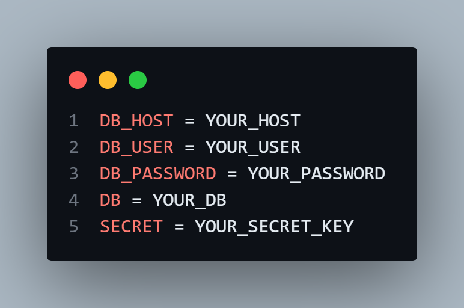

# Edukatec
Simplify evaluation and administrative tasks of a kindergarten - EJS, Node.js
# Environment Variables
Create an .env file and configure your mysql database credentials as well as a secret key to use JSONWebToken

# Database MySQL
`create database users`
# Running the server
`npm run dev`
# Initialize Database
Got to routes/coordinador/entidades.js
and follow the instructions at line 225
then go to http://localhost:8080/sam
